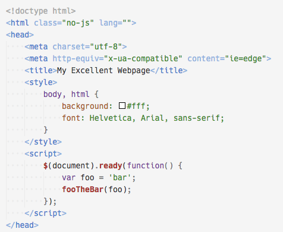

# Quiet Light for VSC

Quiet Light for VSC is a light, peaceful theme, ported to Visual Studio Code by me, the designer of the original Quiet Light theme for MacRabbit's Espresso text editor on macOS.

When I launched Visual Studio Code for the first time I was surprised and delighted to find that my Quiet Light theme was included by default. However, it was a little rough around the edges (I didn't have anything to do with the Textmate port of the theme), and thus Quiet Light for VSC was born.

I hope you enjoy working by Quiet Light! Please [let me know](http://onecrayon.com/about/contact/) if you run across any problems or have any suggestions to make it better (or alternately [submit a pull request on GitHub](https://github.com/onecrayon/theme-quietlight-vsc)).

## Officially tested for:

* HTML
* CSS / LESS / SCSS
* JavaScript
* PHP
* Python
* Markdown

## Known issues

* No background colors for PHP, embedded JS, or embedded CSS
* PHP coloration in HTML attribute strings is currently borked
* Several JS function calls are bold, despite scope being overridden
* SCSS commas in selectors (and some tag names) are uncolored (no syntax zone)
* HTML `<style>` tag attribute equal signs are miscolored (no syntax zone)
